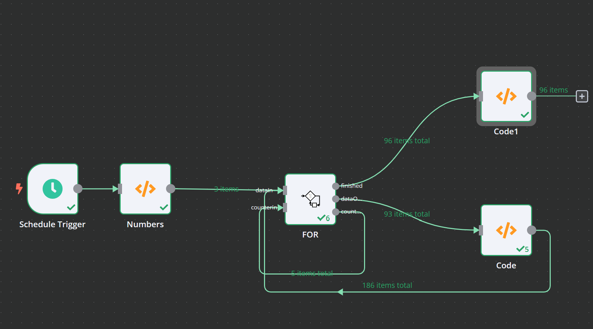

# n8n-advanced-flow-nodes

This is an n8n community node. It lets you do some advanced flows. The n8n default provides different flow nodes to switch, if or filter data. These nodes come with 2 disadvantages:

1. There is no possibility to get statistics
2. There is no possibility to check for any/none matches

These advanced flow nodes fix both these issues.

[n8n](https://n8n.io/) is a [fair-code licensed](https://docs.n8n.io/reference/license/) workflow automation platform.

[Installation](#installation)  
[Operations](#operations)  
[Compatibility](#compatibility)  
[Usage](#usage)  <!-- delete if not using this section -->  
[Resources](#resources)  

## Installation

Follow the [installation guide](https://docs.n8n.io/integrations/community-nodes/installation/) in the n8n community nodes documentation.

## Operations

* [Any](./docs/any.md)
* [FilterAdvanced](./docs/filterAdvanced.md)
* [IfAdvanced](./docs/ifAdvanced.md)
* [Paging](./docs/paging.md)


## Compatibility

This node was built for n8n version 1.20.0.

## Usage

### If Advanced

The logic equals the one of the standard IF-Node; see [the official documentation](https://docs.n8n.io/integrations/builtin/core-nodes/n8n-nodes-base.if/#branch-execution-with-if-and-merge-nodes).

The _advanced_ part is the **Statistics** capability. The IfAdvanced Node provides an additional exit 

````
		{
			allTrue(boolean): Are all true?,
			allFalse (boolean): Are all false?,
			trueCount: How many turned out to be true?,
			falseCount: How many turned out to be false?
		};
````


### Filter Advanced

The logic equals the one of the standard Filter-Node; see [the official documentation](https://docs.n8n.io/integrations/builtin/core-nodes/n8n-nodes-base.filter).

The _advanced_ part is the **Statistics** capability. The FilterAdvanced Node provides an additional exit 

````
{
	dropAll(boolean):Were all data filtered out?
	keepAll(boolean): Did the filter match all the data?
	kept: How many items were kept?
	dropped: How many items were dropped?
};
````


### Any 

The logic equals the one of the standard Filter-Node; see [the official documentation](https://docs.n8n.io/integrations/builtin/core-nodes/n8n-nodes-base.filter).

Different from the Filter or Filter Advanced node, you can return all data in case of any match or just the first match. Additionally, there is a NONE-Exit that is only filled (with all entries) if no item was found that matches the filter. 

````
{
	dropAll(boolean):Were all data filtered out?
	keepAll(boolean): Did the filter match all the data?
	kept: How many items were kept?
	dropped: How many items were dropped?
};
````

### For Loop

The For-Loop can be used to iterate over a specific workflow multiple times.



## Resources

* [n8n community nodes documentation](https://docs.n8n.io/integrations/community-nodes/)
